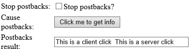
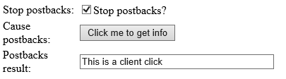

# Stop postback in javascript
## Requires
- Visual Studio 2012
## License
- MS-LPL
## Technologies
- ASP.NET
## Topics
- Postback
## Updated
- 01/16/2013
## Description

<h1>Stop postback in javascript (CSASPNETStopPostbackInJS)</h1>
<h2>Introduction</h2>

The project illustrates how to stop postbacks event in JavaScript. There are many threads mention about this kind of questions, user want to know how to stop auto-postbacks event by using ASP.NET server control, such as Button.That's
 the reason why we need this sample, here we give a CheckBox control in page, user can decide to execute postbacks event or not by a convenient way.

<h2>Running the Sample </h2>

Step 1:&nbsp;&nbsp;
Open the CSASPNETStopPostbackInJS.sln. 

Step 2:&nbsp;&nbsp;
Expand the CSASPNETStopPostbackInJS web application and press Ctrl &#43; F5 to show the Default.aspx.

Step 3:&nbsp;&nbsp;
In Default.aspx page, there are two links. Click one of them, please.

Step 4:&nbsp;&nbsp;
Click the button of StopPostBack1.aspx page, and you can find some text in TextBox. If you don&#39;t select the CheckBox that means allow application to&nbsp;execute postbacks event, the TextBox will
 show &quot;This is a client click. This is a server click&quot;.

Step 5:&nbsp;&nbsp;
Select CheckBox and click Button again, and the TextBox will only display &quot;This is a client click&quot;. The application has stopped postbacks event already.

Step 6:&nbsp;&nbsp;
Return to Default.aspx page and select another link for testing.

Step 7:&nbsp;&nbsp;
Validation finished.

<h2>Using the Code </h2>

Step 1:&nbsp;&nbsp;
Create a C# &quot;ASP.NET Empty Web Application&quot; in Visual Studio 2012 or Visual Web Developer 2012. Name it as &quot;CSASPNETStopPostbackInJS&quot;.

Step 2:&nbsp;&nbsp;
Add three web forms in the root directory, name them as &quot;Default.aspx&quot;,
&nbsp;&quot;StopPostBack1.aspx&quot;, &quot;StopPostBack2.aspx&quot;..

Step 3:&nbsp;&nbsp;
Add two links in Default.aspx page, assign to StopPostBack1.aspx and StopPostBack2.aspx.

Step 4:&nbsp;&nbsp;
Create a html table in StopPostBack1.aspx page and fill it with some labels, checkboxes, buttons and a html textbox, add button's onClientClick and onClick events. Coding JavaScript function like this:

JavaScript

Edit|Remove

js

<pre id="codePreview" class="js">
function onClientClickEvent() {
&nbsp;&nbsp;&nbsp;&nbsp;&nbsp;&nbsp;&nbsp;&nbsp; var text = document.getElementById('textDisplay');
&nbsp;&nbsp;&nbsp;&nbsp;&nbsp;&nbsp;&nbsp;&nbsp; var checkbox = document.getElementById('chkStopPostback');
&nbsp;&nbsp;&nbsp;&nbsp;&nbsp;&nbsp;&nbsp;&nbsp; text.value = &quot;This is a client click&quot;;
&nbsp;&nbsp;&nbsp;&nbsp;&nbsp;&nbsp;&nbsp;&nbsp; if (checkbox.checked == true) {
&nbsp;&nbsp;&nbsp;&nbsp;&nbsp;&nbsp;&nbsp;&nbsp;&nbsp;&nbsp;&nbsp; return false;
&nbsp;&nbsp;&nbsp;&nbsp;&nbsp;&nbsp;&nbsp;&nbsp; }
&nbsp;&nbsp;&nbsp;&nbsp;&nbsp;&nbsp;&nbsp;&nbsp; else {
&nbsp;&nbsp;&nbsp;&nbsp;&nbsp;&nbsp;&nbsp;&nbsp;&nbsp;&nbsp;&nbsp; return true;
&nbsp;&nbsp;&nbsp;&nbsp;&nbsp;&nbsp;&nbsp;&nbsp; }
&nbsp;&nbsp;&nbsp;&nbsp;&nbsp; }

</pre>

&nbsp;

Use button's onClientClick event to invoke this function. It will check the status of checkbox to decide execute postbacks event or not, the button will not execute server-side code when JavaScript function return false.&nbsp;
Add following code in function btnCausePostback_Click:

C#

Edit|Remove

csharp

<pre id="codePreview" class="csharp">
textDisplay.Value &#43;= &quot;&nbsp; This is a server click&quot;;

</pre>

&nbsp;

Step 5:&nbsp;&nbsp;
StopPostBack2.aspx's layout is similar to StopPostBack2.aspx, you need to add a new html button control and change server button to a hidden button control.

Step 6:&nbsp;&nbsp;
Use html button's onClick event call JavaScript function.

Step 7:&nbsp;&nbsp;
Build the application and you can debug it.

<h2>More Information</h2>

MSDN: postbacks Event 
<a href="http://msdn.microsoft.com/en-us/library/aa720416(VS.71).aspx">http://msdn.microsoft.com/en-us/library/aa720416(VS.71).aspx</a>

