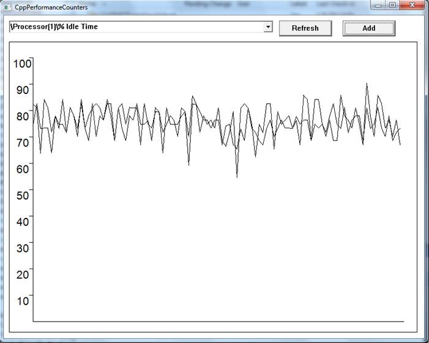

# Use  PerformanceCounter to get CPU Usage
## Requires
- Visual Studio 2012
## License
- Apache License, Version 2.0
## Technologies
- WMI
- System Administration
- Windows Desktop App Development
## Topics
- CPU
- PerformanceCounter
## Updated
- 08/05/2013
## Description

<h1>Track the system CPU usage (CppCpuUsage)</h1>
<h2>Introduction</h2>

This code sample demonstrates how to use the PerformanceCounter to track the CPU usage of the system or a certain process.&nbsp;
It lets the user visualize a Plot of one or more Performance Counter Value against time.

<h2>Building the Sample</h2>

1.&nbsp;&nbsp;&nbsp;&nbsp;&nbsp;&nbsp;
Open Solution in Visual Studio 2010.

2.&nbsp;&nbsp;&nbsp;&nbsp;&nbsp;&nbsp;
Go to &quot;Build&quot; -&gt; &quot;Build Solution&quot;

<h2>Running the Sample</h2>

1.&nbsp;&nbsp;&nbsp;&nbsp;&nbsp;&nbsp;
Open Solution in Visual Studio 2012

2.&nbsp;&nbsp;&nbsp;&nbsp;&nbsp;&nbsp;
Go to &quot;Debug&quot; -&gt; &quot;Start without Debugging&quot;

3.&nbsp;&nbsp;&nbsp;&nbsp;&nbsp;&nbsp;
From Drop Down, Select Performance Counter of Interest.

4.&nbsp;&nbsp;&nbsp;&nbsp;&nbsp;&nbsp;
Click &quot;Add&quot;

5.&nbsp;&nbsp;&nbsp;&nbsp;&nbsp;&nbsp;
See a graph of Performance Counter value against time.

6.&nbsp;&nbsp;&nbsp;&nbsp;&nbsp;&nbsp;
You may add more counters by Repeating Steps 3 and 4.

<h2>Using the Code</h2>

This sample code functions in following high-level steps

1.&nbsp;&nbsp;&nbsp;&nbsp;&nbsp;&nbsp;
First List Down Valid Counter Names. For each processor a &quot;Processor Time&quot; and &quot;Idle Time&quot; performance counter is added. For each running process a &quot;Processor Time&quot; performance counter is added.

2.&nbsp;&nbsp;&nbsp;&nbsp;&nbsp;&nbsp;
A List of &quot;Selected&quot; Performance Counter is maintained. It is initialized to Empty Vector. When user selects a performance counter and clicks &quot;Add&quot;, that counter is added to the vector.

3.&nbsp;&nbsp;&nbsp;&nbsp;&nbsp;&nbsp;
A Thread runs in parallel. This Periodically, Queries each Performance Counter in the &quot;Selected&quot; list. The performance counters are plotted against time using GDI&#43;.

Following are the reusable components of the Sample Code

1.&nbsp;&nbsp;&nbsp;&nbsp;&nbsp;&nbsp;
Get the Processor Count of System 

C&#43;&#43;

Edit|Remove

cplusplus

<pre id="codePreview" class="cplusplus">
DWORD GetProcessorCount()
{
    SYSTEM_INFO sysinfo; 
    DWORD dwNumberOfProcessors;

    GetSystemInfo(&sysinfo);

    dwNumberOfProcessors = sysinfo.dwNumberOfProcessors;

    return dwNumberOfProcessors;
}

</pre>

&nbsp;

2.&nbsp;&nbsp;&nbsp;&nbsp;&nbsp;&nbsp;
Get list of running process 

C&#43;&#43;

Edit|Remove

cplusplus

<pre id="codePreview" class="cplusplus">
vector&lt;PCTSTR&gt; GetProcessNames()
{
    DWORD dwProcessID[SIZE];
    DWORD cbProcess;
    DWORD cProcessID;
    BOOL fResult = FALSE;
    DWORD index;

    HANDLE hProcess;
    HMODULE lphModule[SIZE];
    DWORD cbNeeded;    
    int len;

    vector&lt;PCTSTR&gt; vProcessNames;

    TCHAR * szProcessName;
    TCHAR * szProcessNameWithPrefix;

    fResult = EnumProcesses(dwProcessID, sizeof(dwProcessID), &cbProcess);

    if(!fResult)
    {
        goto cleanup;
    }

    cProcessID = cbProcess / sizeof(DWORD);

    for( index = 0; index &lt; cProcessID; index&#43;&#43; )
    {
        szProcessName = new TCHAR[MAX_PATH];        
        hProcess = OpenProcess( PROCESS_QUERY_INFORMATION |
        PROCESS_VM_READ,
        FALSE, dwProcessID[index] );
        if( NULL != hProcess )
        {
            if ( EnumProcessModulesEx( hProcess, lphModule, sizeof(lphModule), 
                &cbNeeded,LIST_MODULES_ALL) )
            {
                if( GetModuleBaseName( hProcess, lphModule[0], szProcessName, 
                    MAX_PATH ) )
                {
                    len = _tcslen(szProcessName);
                    _tcscpy(szProcessName&#43;len-4, TEXT(&quot;\0&quot;));
                    
                    bool fProcessExists = false;
                    int count = 0;
                    szProcessNameWithPrefix = new TCHAR[MAX_PATH];
                    _stprintf(szProcessNameWithPrefix, TEXT(&quot;%s&quot;), szProcessName);
                    do
                    {
                        if(count&gt;0)
                        {
                            _stprintf(szProcessNameWithPrefix,TEXT(&quot;%s#%d&quot;),szProcessName,count);
                        }
                        fProcessExists = false;
                        for(auto it = vProcessNames.begin(); it &lt; vProcessNames.end(); it&#43;&#43;)
                        {
                            if(_tcscmp(*it,szProcessNameWithPrefix)==0)
                            {
                                fProcessExists = true;
                                break;
                            }
                        }                    
                        count&#43;&#43;;
                    }
                    while(fProcessExists);
                    
                    vProcessNames.push_back(szProcessNameWithPrefix);
                }
            }
        }
    }

cleanup:
    szProcessName = NULL;
    szProcessNameWithPrefix = NULL;
    return vProcessNames;
}

</pre>

&nbsp;

3.&nbsp;&nbsp;&nbsp;&nbsp;&nbsp;&nbsp;
Get list of valid&nbsp; 
Performance Counter Names 

C&#43;&#43;

Edit|Remove

cplusplus

<pre id="codePreview" class="cplusplus">
vector&lt;PCTSTR&gt; GetValidCounterNames()
{
    vector&lt;PCTSTR&gt; validCounterNames;
    DWORD dwNumberOfProcessors = GetProcessorCount();
    DWORD index;
    vector&lt;PCTSTR&gt; vszProcessNames;
    TCHAR * szCounterName;

    validCounterNames.push_back(TEXT(&quot;\\Processor(_Total)\\% Processor Time&quot;));
    validCounterNames.push_back(TEXT(&quot;\\Processor(_Total)\\% Idle Time&quot;));

    for( index = 0; index &lt; dwNumberOfProcessors; index&#43;&#43; )
    {
        szCounterName = new TCHAR[MAX_PATH];
        _stprintf(szCounterName, TEXT(&quot;\\Processor(%u)\\%% Processor Time&quot;),index);
        validCounterNames.push_back(szCounterName);
        szCounterName = new TCHAR[MAX_PATH];
        _stprintf(szCounterName, TEXT(&quot;\\Processor(%u)\\%% Idle Time&quot;),index);
        validCounterNames.push_back(szCounterName);
    }

    vszProcessNames = GetProcessNames();

    for(auto element = vszProcessNames.begin(); 
        element &lt; vszProcessNames.end(); 
        element&#43;&#43; )
    {
        szCounterName = new TCHAR[MAX_PATH];
        _stprintf(szCounterName, TEXT(&quot;\\Process(%s)\\%% Processor Time&quot;),*element);
        validCounterNames.push_back(szCounterName);
    }    
    
cleanup:
    szCounterName = NULL;
    return validCounterNames;
}

</pre>

&nbsp;

4.&nbsp;&nbsp;&nbsp;&nbsp;&nbsp;&nbsp;
class Query: For querying Performance Counters

a)&nbsp;&nbsp;&nbsp;&nbsp;&nbsp;
Adds a Performance Counter to Log.

C&#43;&#43;

Edit|Remove

cplusplus

<pre id="codePreview" class="cplusplus">
void Query::AddCounterInfo(PCWSTR name)
{
    if(fIsWorking)
    {
        PDH_STATUS status;
        CounterInfo ci;
        ci.counterName = name;
        status = PdhAddCounter(query, ci.counterName, 0 , &ci.counter);

        if(status != ERROR_SUCCESS)
        {
            return;
        }

        vciSelectedCounters.push_back(ci);
    }
}

</pre>

&nbsp;

&nbsp;&nbsp;&nbsp;&nbsp;&nbsp;&nbsp;&nbsp;&nbsp;&nbsp;&nbsp;&nbsp;&nbsp;&nbsp;&nbsp;&nbsp;
&nbsp;&nbsp; b) Query once for each Selected Performance Counter.

C&#43;&#43;

Edit|Remove

cplusplus

<pre id="codePreview" class="cplusplus">
void Query::Record()
{
    PDH_STATUS status;
    ULONG CounterType;
    ULONG WaitResult;
    PDH_FMT_COUNTERVALUE DisplayValue;    

    status = PdhCollectQueryData(query);

    if(status != ERROR_SUCCESS)
    {
        return;
    }

    status = PdhCollectQueryDataEx(query, SAMPLE_INTERVAL, Event);

    if(status != ERROR_SUCCESS)
    {
        return;
    }

    WaitResult = WaitForSingleObject(Event, INFINITE);

    if (WaitResult == WAIT_OBJECT_0) 
    {
        for(auto it = vciSelectedCounters.begin(); it &lt; vciSelectedCounters.end(); it&#43;&#43;)
        {
            status = PdhGetFormattedCounterValue(it-&gt;counter, PDH_FMT_DOUBLE, &CounterType, &DisplayValue);            

            if(status != ERROR_SUCCESS)
            {
                continue;
            }

            Log log;
            log.time = time;
            log.value = DisplayValue.doubleValue;
            it-&gt;logs.push_back(log);                
        }
    }

    time&#43;&#43;;
}

</pre>

&nbsp;

