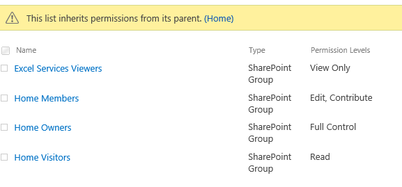

# Use JSOM to change a user's permissions on lists and libraries in SharePoint
## Requires
- Visual Studio 2013
## License
- Apache License, Version 2.0
## Technologies
- SharePoint
- SharePoint 2013
## Topics
- JSON
- Permission
## Updated
- 09/22/2016
## Description

<strong>&nbsp;</strong><em></em>

How to use JSOM to change a user's permissions on lists and libraries in SharePoint (SPSChangeUserListPermission)

Introduction

&nbsp;This sample demonstrates how to use JavaScript Object Model to change user permission on list or library.

Running the Sample

&bull;&nbsp; Open the project by double-clicking the SPSChangeUserListPermission.sln.

&bull;&nbsp; Locate the CSSPSChangeUserListPermission folders under the Layouts folder. Open the ChangePermissions.aspx page. In the
CustomPermission function, modify the following variables to yours: list
name (RatingList in this sample), username (domain\username)
and the RoleType (SP.RoleType.contributor in this sample).

&bull;&nbsp; In the Solution Explorer window, right-click the project name and then click Deploy.

&bull;&nbsp; View the ChangePermissions page in the web browser.
The link resembles the following:

Yoursite/_layouts/15/CSSPSChangeUserListPermission/changepermissions.aspx.

Before running the changepermissions page, we will have
list permissions as
shown below:

After running the changepermissions page,
we will get list permissions of new levels
as shown below:

&bull;&nbsp; Validation is finished.

Using the Code

&bull;&nbsp;Start Visual Studio.

&bull;&nbsp;On the File menu, click
New, and then click Project.

&bull;&nbsp;In the Installed Templates section
of the New
Project dialog box, expand either Visual Basic or Visual C#, expand
SharePoint, and then click 
Empty SharePoint Project.

&bull;&nbsp;Right-click the project to add the desired folder.

&quot;Add&quot;
&gt;&gt;&quot;SharePoint Layouts Mapped Folder&quot;.

&bull;&nbsp;Right-click the &quot;Layouts&quot; folder then add a new folder named &quot;ChangeUserListPermission&quot;, then add a new Page named &quot;ChangePermissions.aspx&quot;.

&bull;&nbsp;Add references to relevant JavaScript files to the page:

HTML

Edit|Remove

html

<pre class="html" id="codePreview">&lt;script type=&quot;text/javascript&quot; src=&quot;jquery-1.9.1.min.js&quot;&gt;&lt;/script&gt;
&lt;script type=&quot;text/javascript&quot; src=&quot;/_layouts/15/sp.runtime.js&quot;&gt;&lt;/script&gt;
&lt;script type=&quot;text/javascript&quot; src=&quot;/_layouts/15/sp.js&quot;&gt;&lt;/script&gt;
&lt;% #if SOME_UNDEFINED_CONSTANT %&gt; 
&lt;script type=&quot;text/ecmascript&quot; src=&quot;/_layouts/SP.core.debug.js&quot; &gt;&lt;/script&gt;
&lt;script type=&quot;text/ecmascript&quot; src=&quot;/_layouts/SP.runtime.debug.js&quot; &gt;&lt;/script&gt;
&lt;script type=&quot;text/ecmascript&quot; src=&quot;/_layouts/SP.debug.js&quot; &gt;&lt;/script&gt;
&lt;% #endif %&gt;
</pre>

&nbsp;

&bull;&nbsp; And then use the following script to handle the operation:

JavaScript

Edit|Remove

js

<pre class="js" id="codePreview">&lt;script type=&quot;text/javascript&quot;&gt;
        $(document).ready(function () {
            // Call the function.
            CustomPermission();
        });
        // Web of current client context.
        var web;
        // The list\Library will be operation.
        var oList;
        // The user will be operation.
        var oUser;
        // The roles will be operation.
        var roles;
        function CustomPermission() {
            // Get current client context.
            var clientContext = new SP.ClientContext.get_current();
            // Get current web.
            this.web = clientContext.get_web();
            // Provide the existing list name.
            this.oList = this.web.get_lists().getByTitle('RatingList');
            // Break the inheritance. 
            this.oList.breakRoleInheritance(false, true);
            // Get the user(domain\username).
            this.oUser = this.web.ensureUser(&quot;seiyasu\\seiya&quot;);
            // Define the roles that will be operation.
            this.roles = SP.RoleDefinitionBindingCollection.newObject(clientContext);
            this.roles.add(web.get_roleDefinitions().getByType(SP.RoleType.contributor));
            // Register the role for the user.
            this.oList.get_roleAssignments().add(this.oUser, this.roles)
            clientContext.load(this.web);
            clientContext.load(this.oUser);
            clientContext.load(this.oList);
            //Make a query call to execute the above statements
            clientContext.executeQueryAsync(Function.createDelegate(this, this.onQuerySuccess),
                Function.createDelegate(this, this.onQueryFailure));
        }
      
        function onQuerySuccess() {
            $('#message').text('Updated');
        }
        function onQueryFailure(sender, args) {
            alert('Request failed. ' &#43; args.get_message() &#43; '\n' &#43; args.get_stackTrace());
        }
&lt;/script&gt; 
</pre>

&nbsp;

&bull;&nbsp;Now
you can build and debug it.

&nbsp;

More Information

SharePoint 2013 .NET Server, CSOM, JSOM, and REST API index
 
<a href="http://msdn.microsoft.com/en-us/library/office/dn268594(v=office.15).aspx" style="text-decoration:none">http://msdn.microsoft.com/en-us/library/office/dn268594(v=office.15).aspx</a>
 
How to: Add and Remove Mapped Folders
 
<a href="http://msdn.microsoft.com/en-us/library/ee231521.aspx" style="text-decoration:none">http://msdn.microsoft.com/en-us/library/ee231521.aspx</a>
 
SP.ClientContext Class
 
<a href="http://msdn.microsoft.com/en-us/library/office/ff408569(v=office.14).aspx" style="text-decoration:none">http://msdn.microsoft.com/en-us/library/office/ff408569(v=office.14).aspx</a>
 
SPRoleType enumeration
 
<a href="http://msdn.microsoft.com/en-us/library/microsoft.sharepoint.sproletype.aspx" style="text-decoration:none">http://msdn.microsoft.com/en-us/library/microsoft.sharepoint.sproletype.aspx</a>
 
SP.RoleDefinitionBindingCollection Class
 
<a href="http://msdn.microsoft.com/en-us/library/office/ff410029(v=office.14).aspx" style="text-decoration:none">http://msdn.microsoft.com/en-us/library/office/ff410029(v=office.14).aspx</a>
 
How to: Work with Roles Using JavaScript
 
<a href="http://msdn.microsoft.com/en-us/library/office/hh185014(v=office.14).aspx" style="text-decoration:none">http://msdn.microsoft.com/en-us/library/office/hh185014(v=office.14).aspx</a>
 
SPRoleDefinitionCollection class
 
<a href="http://msdn.microsoft.com/en-us/library/office/microsoft.sharepoint.sproledefinitioncollection(v=office.15).aspx" style="text-decoration:none">http://msdn.microsoft.com/en-us/library/office/microsoft.sharepoint.sproledefinitioncollection(v=office.15).aspx</a>
 

 

Microsoft All-In-One Code Framework is a free, centralized code sample library driven by developers' real-world pains and needs. The goal is to provide customer-driven code samples for all Microsoft development technologies,
 and reduce developers' efforts in solving typical programming tasks. Our team listens to developers&rsquo; pains in the MSDN forums, social media and various DEV communities. We write code samples based on developers&rsquo; frequently asked programming tasks,
 and allow developers to download them with a short sample publishing cycle. Additionally, we offer a free code sample request service. It is a proactive way for our developer community to obtain code samples directly from Microsoft.

