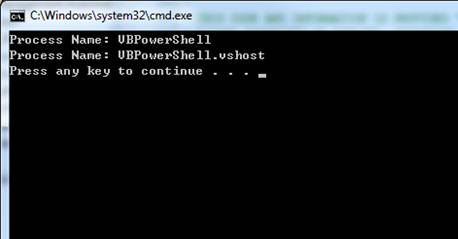

# VB app invokes PowerShell script (VBPowerShell)
## Requires
- Visual Studio 2010
## License
- MS-LPL
## Technologies
- Powershell
## Topics
- Powershell
## Updated
- 03/01/2012
## Description

<h1>VB app invokes PowerShell script (VBPowerShell)
</h1>
<h2>Introduction</h2>

 
This sample indicates how to call <b style="">Powershell</b> from VB.NET language. It first
creates a <b style="">Runspace</b> object in
<b style="">System.Management.Automation</b> namespace. Then it creates a
<b style="">Pipeline</b> from <b style="">Runspace</b>. The
<b style="">Pipeline</b> is used to host a line of commands which are supposed to be executed. The example call
<b style="">Get-Process </b>command to get all processes whose name start with &quot;V&quot;.

<h2>Building the Sample </h2>

To create this project, we first need to install PowerShell. We can find the download link from the following KB article:
<a href="http://support.microsoft.com/kb/968929">http://support.microsoft.com/kb/968929</a>

<h2>Running the Sample </h2>

Press F5 to run this application, and you will see following result.

<h2>Using the Code </h2>

1.&nbsp;&nbsp;&nbsp;&nbsp;&nbsp;&nbsp;
Create a <b style="">RunSpace</b> to host the
<b style="">Powershell</b> script environment using
<b style="">RunspaceFactory.CreateRunSpace</b>. 

VB

Edit|Remove

vb
<pre class="hidden">
Dim runSpace As Runspace = RunspaceFactory.CreateRunspace()
runSpace.Open()

</pre>
<pre id="codePreview" class="vb">
Dim runSpace As Runspace = RunspaceFactory.CreateRunspace()
runSpace.Open()

</pre>

&nbsp;

2.&nbsp;&nbsp;&nbsp;&nbsp;&nbsp;&nbsp;
Create a <b style="">Pipeline</b> to host commands to be executed using
<b style="">Runspace.CreatePipeline</b>. 

VB

Edit|Remove

vb
<pre class="hidden">
Dim pipeLine As Pipeline = runSpace.CreatePipeline()

</pre>
<pre id="codePreview" class="vb">
Dim pipeLine As Pipeline = runSpace.CreatePipeline()

</pre>

&nbsp;

3.&nbsp;&nbsp;&nbsp;&nbsp;&nbsp;&nbsp;
Create a <b style="">Command</b> object by passing the command to the constructor.

VB

Edit|Remove

vb
<pre class="hidden">
Dim getProcessCStarted As New Command(&quot;Get-Process&quot;)

' Add parameters to the Command. 
getProcessCStarted.Parameters.Add(&quot;name&quot;, &quot;V*&quot;)

</pre>
<pre id="codePreview" class="vb">
Dim getProcessCStarted As New Command(&quot;Get-Process&quot;)

' Add parameters to the Command. 
getProcessCStarted.Parameters.Add(&quot;name&quot;, &quot;V*&quot;)

</pre>

&nbsp;

4.&nbsp;&nbsp;&nbsp;&nbsp;&nbsp;&nbsp;
Add the commands to the <b style="">Pipeline</b>.

VB

Edit|Remove

vb
<pre class="hidden">
pipeLine.Commands.Add(getProcessCStarted)

</pre>
<pre id="codePreview" class="vb">
pipeLine.Commands.Add(getProcessCStarted)

</pre>

&nbsp;

5.&nbsp;&nbsp;&nbsp;&nbsp;&nbsp;&nbsp;
Run all commands in the current pipeline by calling
<b style="">Pipeline.Invoke</b>. It returns a 
<b style="">System.Collections.ObjectModel.Collection</b> object.&nbsp;
In this example, the executed script is &quot;Get-Process -name V*&quot;. 

VB

Edit|Remove

vb
<pre class="hidden">
Dim vNameProcesses As Collection(Of PSObject) = pipeLine.Invoke()
Dim psObject As PSObject
For Each psObject In vNameProcesses
    Dim process As Process = TryCast(psObject.BaseObject, Process)
    Console.WriteLine(&quot;Process Name: {0}&quot;, process.ProcessName)
Next

</pre>
<pre id="codePreview" class="vb">
Dim vNameProcesses As Collection(Of PSObject) = pipeLine.Invoke()
Dim psObject As PSObject
For Each psObject In vNameProcesses
    Dim process As Process = TryCast(psObject.BaseObject, Process)
    Console.WriteLine(&quot;Process Name: {0}&quot;, process.ProcessName)
Next

</pre>

&nbsp;

<h2>More Information </h2>

<a href="http://msdn.microsoft.com/en-us/library/system.management.automation.runspaces.runspace(VS.85).aspx">MSDN: Runspace Class</a>

<a href="http://msdn.microsoft.com/en-us/library/ms569128(VS.85).aspx">MSDN: Pipeline.Invoke Method ()</a>

<a href="http://social.msdn.microsoft.com/Forums/en-AU/csharpgeneral/thread/faa70c95-6191-4f64-bb5a-5b67b8453237">How to call Powershell Script function from C# ?</a>

