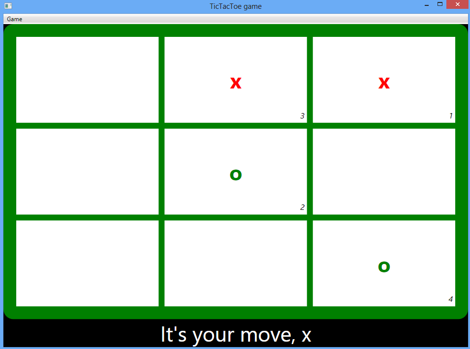

# WPF MVVM practice demo (CSWPFMVVMPractice)
## Requires
- Visual Studio 2008
## License
- MS-LPL
## Technologies
- WPF
## Topics
- MVVM
## Updated
- 11/27/2012
## Description

<h1>How to implement the MVVM pattern in a WPF application (CSWPFMVVMPractice)</h1>
<h2>Introduction</h2>

The sample demonstrates how to implement the MVVM pattern in a WPF application.

<h2>Running the Sample</h2>

Step1. Build the sample project in Visual Studio 2012.

Step2. Click on the cells in the grid. 

Step3. If one player has won the game, a 
messagebox pops up saying &quot;XX has won,Congratulations!&quot;.

Step4. If all the cells in the grid are clicked, but no one has won, a
messagebox pops up saying &quot;No winner&quot;.

Step5. You can change the dimension of the game using the Game menu.

<h2>Using the Code</h2>

1. Model: 

&nbsp;&nbsp;&nbsp;&nbsp;&nbsp;&nbsp;&nbsp;&nbsp;&nbsp;&nbsp;&nbsp;&nbsp;&nbsp;&nbsp;&nbsp;
Cell class - represents a cell in the tic-tac-toe game grid

&nbsp;&nbsp;&nbsp;&nbsp;&nbsp;&nbsp;&nbsp;&nbsp;&nbsp;&nbsp;&nbsp;&nbsp;&nbsp;&nbsp;&nbsp;
PlayerMove class - represents a player move in the game

2. ViewModel:

&nbsp;&nbsp;&nbsp;&nbsp;&nbsp;&nbsp;&nbsp;&nbsp;&nbsp;&nbsp;&nbsp;&nbsp;&nbsp;&nbsp;&nbsp;
TicTacToeViewModel - contains game's logic and data

3. View:

&nbsp;&nbsp;&nbsp;&nbsp;&nbsp;&nbsp;&nbsp;&nbsp;&nbsp;&nbsp;&nbsp;&nbsp;&nbsp;&nbsp;&nbsp;
MainWindow.xaml - contains a Menu and an 
ItemsControl

4. Others:

&nbsp;&nbsp;&nbsp;&nbsp;&nbsp;&nbsp;&nbsp;&nbsp;&nbsp;&nbsp;&nbsp;&nbsp;&nbsp;&nbsp;&nbsp;
a. Attached behavior

&nbsp;&nbsp;&nbsp;&nbsp;&nbsp;&nbsp;&nbsp;&nbsp;&nbsp;&nbsp;&nbsp;&nbsp;&nbsp;&nbsp;&nbsp;&nbsp;&nbsp;&nbsp;&nbsp;&nbsp;&nbsp;&nbsp;&nbsp;&nbsp;&nbsp;&nbsp;&nbsp;&nbsp;&nbsp;&nbsp;&nbsp;
ChangeDimensionBehavior - connect the 
MenuItem in the View to the TicTacToeViewModel in order to change the game's dimension

&nbsp;&nbsp;&nbsp;&nbsp;&nbsp;&nbsp;&nbsp;&nbsp;&nbsp;&nbsp;&nbsp;&nbsp;&nbsp;&nbsp;&nbsp;&nbsp;&nbsp;&nbsp;&nbsp;&nbsp;&nbsp;&nbsp;&nbsp;&nbsp;&nbsp;&nbsp;&nbsp;&nbsp;&nbsp;&nbsp;&nbsp;
ShutdownBehavior - contains code to exit the application&nbsp;&nbsp;&nbsp;&nbsp;&nbsp;&nbsp;&nbsp;&nbsp;&nbsp;&nbsp;&nbsp;&nbsp;&nbsp;&nbsp;&nbsp;&nbsp;&nbsp;&nbsp;&nbsp;&nbsp;&nbsp;&nbsp;&nbsp;&nbsp;&nbsp;&nbsp;&nbsp;

&nbsp;&nbsp;&nbsp;&nbsp;&nbsp;&nbsp;&nbsp;&nbsp;&nbsp;&nbsp;&nbsp;&nbsp;&nbsp;&nbsp;&nbsp;&nbsp;&nbsp;&nbsp;&nbsp;&nbsp;&nbsp;&nbsp;&nbsp;&nbsp;&nbsp;&nbsp;&nbsp;&nbsp;&nbsp;&nbsp;&nbsp;
GameOverBehavior - listen to the 
GameOver event on the TicTacToeViewModel and show a
messagebox reporting the game result.

&nbsp;&nbsp;&nbsp;&nbsp;&nbsp;&nbsp;&nbsp;&nbsp;&nbsp;&nbsp;&nbsp;&nbsp;&nbsp;&nbsp;&nbsp;
b. ValueConverter

&nbsp;&nbsp;&nbsp;&nbsp;&nbsp;&nbsp;&nbsp;&nbsp;&nbsp;&nbsp;&nbsp;&nbsp;&nbsp;&nbsp;&nbsp;&nbsp;&nbsp;&nbsp;&nbsp;&nbsp;&nbsp;&nbsp;&nbsp;&nbsp;&nbsp;&nbsp;&nbsp;&nbsp;&nbsp;&nbsp;&nbsp;
IntToBoolValueConverter - used to check/uncheck a
MenItem that is used to change the dimension of the game&nbsp;&nbsp;&nbsp;&nbsp;

&nbsp;&nbsp;&nbsp;&nbsp;&nbsp;&nbsp;&nbsp;&nbsp;&nbsp;&nbsp;&nbsp;&nbsp;&nbsp;&nbsp;&nbsp;
c.Command

&nbsp;&nbsp;&nbsp;&nbsp;&nbsp;&nbsp;&nbsp;&nbsp;&nbsp;&nbsp;&nbsp;&nbsp;&nbsp;&nbsp;&nbsp;&nbsp;&nbsp;&nbsp;&nbsp;&nbsp;&nbsp;&nbsp;&nbsp;&nbsp;&nbsp;&nbsp;&nbsp;&nbsp;&nbsp;&nbsp;&nbsp;
RelayCommand - provides an implementation of the
ICommand interface<b> </b>

<h2>More Information</h2>

WPF Apps With The Model-View-ViewModel Design Pattern

<a href="http://msdn.microsoft.com/en-us/magazine/dd419663.aspx">http://msdn.microsoft.com/en-us/magazine/dd419663.aspx</a>

Introduction to Attached Behaviors in WPF 

<a href="http://www.codeproject.com/KB/WPF/AttachedBehaviors.aspx">http://www.codeproject.com/KB/WPF/AttachedBehaviors.aspx</a>

