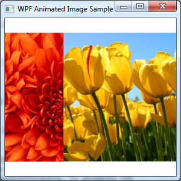

# WPF animated image show (CSWPFAnimatedImage)
## Requires
- Visual Studio 2008
## License
- MS-LPL
## Technologies
- WPF
## Topics
- Animation
## Updated
- 03/01/2012
## Description

<h1>WPF animated image show (CSWPFAnimatedImage)
</h1>
<h2>Introduction</h2>

 
The sample demonstrates how to display a series of photos just like a digital
picture frame with a &quot;Wipe&quot; effect. 

<h2>Running the Sample </h2>

Press F5 to run this application, you will see that the window displays
a series of photos just like a digital picture frame with a &quot;Wipe&quot; effect.

&nbsp; 

<h2>Using the Code </h2>

1.&nbsp;&nbsp;&nbsp;&nbsp;&nbsp;&nbsp;
Add two Image controls named myImage1 and myImage2 on a Window. The myImage1
lies on top of the myImage2. 

2.&nbsp;&nbsp;&nbsp;&nbsp;&nbsp;&nbsp;
Set the OpacityMask of the myImage1 to a LinearGradientBrush. Add two GradientStop in the LinearGradientBrush.

3.&nbsp;&nbsp;&nbsp;&nbsp;&nbsp;&nbsp;
Add two Storyboards in the resource dictionary of the Window. One storyboard is named VisibleToInvisible. It animates the two GradientStop above to hide themyImage1. The other storyboard is named InvisibleToVisible. It animates
 thetwo GradientStop to show the myImage1. 

4.&nbsp;&nbsp;&nbsp;&nbsp;&nbsp;&nbsp;
Create a collection of type List&lt;BitmapImage&gt; and add images to be shown in the collection when the Window is loaded.

5.&nbsp;&nbsp;&nbsp;&nbsp;&nbsp;&nbsp;
Subscribe the Completed event of the two storyboards.

6.&nbsp;&nbsp;&nbsp;&nbsp;&nbsp;&nbsp;
In the Completed event handler of the VisibleToInvisible storyboard, changethe Source of the myImage1 to the next image to be shown. Get the InvisibleToVisible storyboard from the resource dictionary and start it.

7.&nbsp;&nbsp;&nbsp;&nbsp;&nbsp;&nbsp;
In the Completed event handler of the InvisibleToVisible storyboard, changethe Source of the myImage2 to the next image to be shown. Get the
VisibleToInVisible storyboard from the resource dictionary and start it.

<h2>More Information </h2>

<a href="http://msdn.microsoft.com/en-us/library/system.windows.media.animation.storyboard.aspx">Storyboard Class</a>

