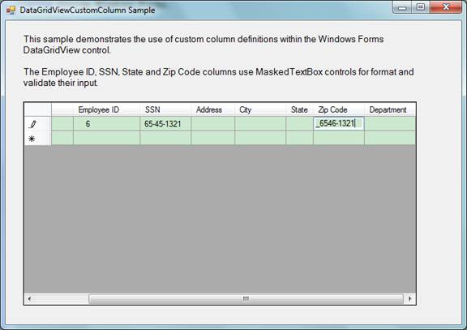
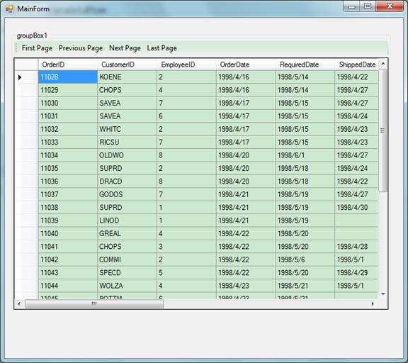
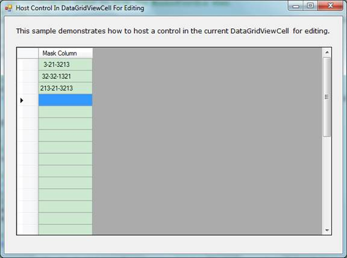
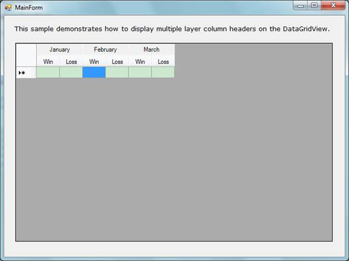
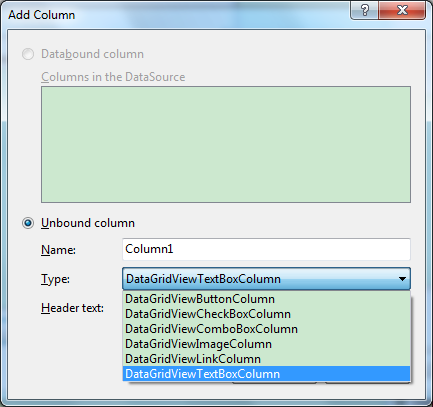

# Windows Forms DataGridView demo (VBWinFormDataGridView)
## Requires
- Visual Studio 2010
## License
- MS-LPL
## Technologies
- Windows Forms
## Topics
- Data Binding
- DataGridView
## Updated
- 03/04/2012
## Description

<h1>WINDOWS FORMS APPLICATION (VBWinFormDataGridView)</h1>
<h2>Introduction</h2>

There are five samples in this solution to demonstrate DataGridView:

1.&nbsp;&nbsp;&nbsp;&nbsp;&nbsp;&nbsp;
CustomDataGridViewColumn:

This sample demonstrates how to create a custom DataGridView column.

2.&nbsp;&nbsp;&nbsp;&nbsp;&nbsp;&nbsp;
DataGridViewPaging:

This sample demonstrates how to page data in the&nbsp;
DataGridView control. 

3.&nbsp;&nbsp;&nbsp;&nbsp;&nbsp;&nbsp;
EditingControlHosting:

This sample demonstrates how to host a control in the current DataGridViewCell&nbsp;
for editing.

4.&nbsp;&nbsp;&nbsp;&nbsp;&nbsp;&nbsp;
JustInTimeDataLoading:

If you are working with a very large table in a remote database, for example, you might want to avoid startup delays by retrieving only the data that is necessary for display and retrieving additional data only when the
 user scrolls&nbsp; new rows into view. If the client computers running your application have a&nbsp;
limited amount of memory available for storing data, you might also want to&nbsp;
discard unused data when retrieving new values from the database.

This sample demonstrates how to use virtual mode in the DataGridView control&nbsp;
with a data cache that loads data from a server only when it is needed.&nbsp;
This kind of data loading is called &quot;Just-in-time data loading&quot;.

5.&nbsp;&nbsp;&nbsp;&nbsp;&nbsp;&nbsp;
MultipleLayeredColumnHeader:

This sample demonstrates how to display multiple layer column headers on the DataGridView contorl.

<h2>Running the Sample</h2>

1.&nbsp;&nbsp;&nbsp;&nbsp;&nbsp;&nbsp;
CustomDataGridViewColumn.

2.&nbsp;&nbsp;&nbsp;&nbsp;&nbsp;&nbsp;
DataGridViewPaging.

3.&nbsp;&nbsp;&nbsp;&nbsp;&nbsp;&nbsp;
EditingControlHosting. 

4.&nbsp;&nbsp;&nbsp;&nbsp;&nbsp;&nbsp;
JustInTimeDataLoading. 

5.&nbsp;&nbsp;&nbsp;&nbsp;&nbsp;&nbsp;
MultipleLayeredColumnHeader.

. 

<h2>Using the Code</h2>

1.&nbsp;&nbsp;&nbsp;&nbsp;&nbsp;&nbsp;
CustomDataGridViewColumn. 

There're six standard DataGridViewColumn types for use as follows:

However, developers may want to use a different control for editing on the column,
e.g. MarkedTextBox, DateTimePicker etc. This feature can be achieved in two ways:

A. Create a custom DataGridViewColumn;

&nbsp;&nbsp; 
The code in this CustomDataGridViewColumn sample demonstrates how to do this;

B. Place the editing control on the current cell when editing begins, and hide the editing control when the editing completes. For the details of this
approach, please refer to the &nbsp;&nbsp;EditingControlHosting sample.

2.&nbsp;&nbsp;&nbsp;&nbsp;&nbsp;&nbsp;
DataGridViewPaging 

A. Get total count of the rows in the table;

B. Calculate total count of pages;

C. Load each page on demand;

3.&nbsp;&nbsp;&nbsp;&nbsp;&nbsp;&nbsp;
EditingControlHosting 

A. Create an instance of the editing control, in this sample the editing control is MaskedTextBox.&nbsp;&nbsp;&nbsp;

B. Specify a mask for the MaskedTextBox and add the MaskedTextBox to the control collection of the DataGridView;&nbsp;&nbsp;

C. Hide the MaskedTextBox;

D. Handle the CellBeginEdit event to show the MaskedTextBox on the current editing cell;&nbsp;&nbsp;

E. Handle the CellEndEdit event to hide the MaskedTextBox when editing completes;

F. Handle the Scroll event to adjust the location of the MaskedTextBox as it is showing when scrolling the DataGridView;

G. Handle the EditingControlShowing event to pass the focus to the MaskedTextBox when begin editing with keystrokes;

4.&nbsp;&nbsp;&nbsp;&nbsp;&nbsp;&nbsp;
JustInTimeDataLoading

A.&nbsp;
Enable VirtualMode on the DataGridView control by setting the VirtualMode property to true:&nbsp;&nbsp;&nbsp;

VB

Edit|Remove

vb

<pre id="codePreview" class="vb">
' Enable VirtualMode on the DataGridView
Me.dataGridView1.VirtualMode = True

</pre>

&nbsp;

B.&nbsp;
Add columns to the DataGridView according to the data in the database;

C.&nbsp;
Retrieve the row count of the data in the database and set the RowCount&nbsp;
property for the DataGridView;&nbsp;&nbsp;&nbsp; 

VB

Edit|Remove

vb

<pre id="codePreview" class="vb">
              ' Handle the CellValueNeeded event to retrieve the requested cell value
            ' from the data store or the Customer object currently in edit.
            ' This event occurs whenever the DataGridView control needs to paint a cell.

            ' Create a DataRetriever and use it to create a Cache object
            ' and to initialize the DataGridView columns and rows.
            Try
                Dim retriever As DataRetriever = New DataRetriever(connectionString, table)
                memoryCache = New Cache(retriever, 16)
                For Each column As DataColumn In retriever.Columns
                    dataGridView1.Columns.Add(column.ColumnName, column.ColumnName)
                Next
                Me.dataGridView1.RowCount = retriever.RowCount
            Catch ex As Exception
                MessageBox.Show(&quot;Connection could not be established. &quot; &#43; _
                    &quot;Verify that the connection string is valid.&quot;)
                Application.Exit()
            End Try

</pre>

&nbsp;

D.&nbsp;
Handle the CellValueNeeded event to retrieve the requested cell value from the data store or the Customer object currently in edit.

VB

Edit|Remove

vb

<pre id="codePreview" class="vb">
Private Sub dataGridView1_CellValueNeeded(ByVal sender As <a class="libraryLink" href="http://msdn.microsoft.com/en-US/library/System.Object.aspx" target="_blank" title="Auto generated link to System.Object">System.Object</a>, ByVal e As <a class="libraryLink" href="http://msdn.microsoft.com/en-US/library/System.Windows.Forms.DataGridViewCellValueEventArgs.aspx" target="_blank" title="Auto generated link to System.Windows.Forms.DataGridViewCellValueEventArgs">System.Windows.Forms.DataGridViewCellValueEventArgs</a>) Handles dataGridView1.CellValueNeeded
    e.Value = memoryCache.RetrieveElement(e.RowIndex, e.ColumnIndex)
End Sub

</pre>

&nbsp;

5.&nbsp;&nbsp;&nbsp;&nbsp;&nbsp;&nbsp;
MultipleLayeredColumnHeader

A.&nbsp;
Enable resizing on the column headers by setting the ColumnHeadersHeightSizeMode property as follows:

VB

Edit|Remove

vb

<pre id="codePreview" class="vb">
' Enable resizing on the column headers
          Me.dataGridView1.ColumnHeadersHeightSizeMode = DataGridViewColumnHeadersHeightSizeMode.EnableResizing

</pre>

&nbsp;

B.&nbsp;
Adjust the height for the column headers to make it wide enough for two layers;

VB

Edit|Remove

vb

<pre id="codePreview" class="vb">
' Adjust the height for the column headers
Me.dataGridView1.ColumnHeadersHeight = Me.dataGridView1.ColumnHeadersHeight * 2

</pre>

&nbsp;

C.&nbsp;
Adjust the text alignment on the column headers to make the text display at the center of the bottom;&nbsp;&nbsp;&nbsp;

VB

Edit|Remove

vb

<pre id="codePreview" class="vb">
             ' Adjust the text alignment on the column headers to make the text display
           ' at the center of the bottom
           Me.dataGridView1.ColumnHeadersDefaultCellStyle.Alignment = DataGridViewContentAlignment.BottomCenter

           ' Handle the CellPainting event to draw text for each header cell

</pre>

&nbsp;

D.&nbsp;
Handle the DataGridView.CellPainting event to draw text for each header&nbsp;
cell; 

VB

Edit|Remove

vb

<pre id="codePreview" class="vb">
Private Sub dataGridView1_CellPainting(ByVal sender As <a class="libraryLink" href="http://msdn.microsoft.com/en-US/library/System.Object.aspx" target="_blank" title="Auto generated link to System.Object">System.Object</a>, ByVal e As <a class="libraryLink" href="http://msdn.microsoft.com/en-US/library/System.Windows.Forms.DataGridViewCellPaintingEventArgs.aspx" target="_blank" title="Auto generated link to System.Windows.Forms.DataGridViewCellPaintingEventArgs">System.Windows.Forms.DataGridViewCellPaintingEventArgs</a>) Handles dataGridView1.CellPainting
           If e.RowIndex = -1 AndAlso e.ColumnIndex &gt; -1 Then
               e.PaintBackground(e.CellBounds, False)
               Dim r2 As Rectangle = e.CellBounds
               r2.Y &#43;= e.CellBounds.Height / 2
               r2.Height = e.CellBounds.Height / 2
               e.PaintContent(r2)
               e.Handled = True
           End If
       End Sub

</pre>

&nbsp;

E.&nbsp;
Handle the DataGridView.Paint event to draw &quot;merged&quot; header cells;

VB

Edit|Remove

vb

<pre id="codePreview" class="vb">
Private Sub dataGridView1_Paint(ByVal sender As <a class="libraryLink" href="http://msdn.microsoft.com/en-US/library/System.Object.aspx" target="_blank" title="Auto generated link to System.Object">System.Object</a>, ByVal e As <a class="libraryLink" href="http://msdn.microsoft.com/en-US/library/System.Windows.Forms.PaintEventArgs.aspx" target="_blank" title="Auto generated link to System.Windows.Forms.PaintEventArgs">System.Windows.Forms.PaintEventArgs</a>) Handles dataGridView1.Paint
           ' Data for the &quot;merged&quot; header cells
           Dim monthes As String() = {&quot;January&quot;, &quot;February&quot;, &quot;March&quot;}
           For j As Integer = 0 To Me.dataGridView1.ColumnCount - 1 Step 2
               ' Get the column header cell bounds
               Dim r1 As Rectangle = Me.dataGridView1.GetCellDisplayRectangle(j, -1, True)

               r1.X &#43;= 1
               r1.Y &#43;= 1
               r1.Width = r1.Width * 2 - 2
               r1.Height = r1.Height / 2 - 2

               Using br As SolidBrush = New SolidBrush(Me.dataGridView1.ColumnHeadersDefaultCellStyle.BackColor)
                   e.Graphics.FillRectangle(br, r1)
               End Using

               Using p As Pen = New Pen(SystemColors.InactiveBorder)
                   e.Graphics.DrawLine(p, r1.X, r1.Bottom, r1.Right, r1.Bottom)
               End Using

               Using format As StringFormat = New StringFormat()
                   Using br As SolidBrush = New SolidBrush(Me.dataGridView1.ColumnHeadersDefaultCellStyle.ForeColor)
                       format.Alignment = StringAlignment.Center
                       format.LineAlignment = StringAlignment.Center
                       e.Graphics.DrawString(monthes(j / 2), Me.dataGridView1.ColumnHeadersDefaultCellStyle.Font, _
                                             br, r1, format)
                   End Using
               End Using
           Next
       End Sub

</pre>

&nbsp;

<h2>More Information</h2>

��&nbsp;&nbsp;&nbsp;&nbsp;&nbsp;&nbsp;&nbsp;&nbsp;
<a href="http://windowsclient.net/blogs/faqs/archive/tags/Custom&#43;Designers/default.aspx">Windows Forms FAQs</a>

��&nbsp;&nbsp;&nbsp;&nbsp;&nbsp;&nbsp;&nbsp;&nbsp;
<a href="http://msdn.microsoft.com/en-us/library/system.windows.forms.datagridview.aspx">DataGridView Class</a>&nbsp;&nbsp;

��&nbsp;&nbsp;&nbsp;&nbsp;&nbsp;&nbsp;&nbsp;&nbsp;
<a href="http://msdn.microsoft.com/en-us/library/ms180996.aspx">DataGridView Custom Column Sample</a>

��&nbsp;&nbsp;&nbsp;&nbsp;&nbsp;&nbsp;&nbsp;&nbsp;
<a href="http://msdn.microsoft.com/en-us/library/ms171624.aspx">Implementing Virtual Mode with Just-In-Time Data Loading in the Windows Forms DataGridView Control.</a>&nbsp;&nbsp;

&nbsp;&nbsp;

