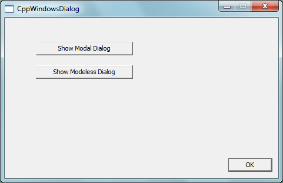

# Windows modal and modeless dialogs in C++ (CppWindowsDialog)
## Requires
- Visual Studio 2008
## License
- MS-LPL
## Technologies
- Windows SDK
## Topics
- Windows Dialog
## Updated
- 03/01/2012
## Description

<h1>WIN32 APPLICATION (CppWindowsDialog)</h1>
<h2>Introduction</h2>

The CppWindowsDialog example demonstrates the skeleton of registered and created window, based on a dialog resource defined in a resource script. It
also shows the steps to show a modal or a modeless dialog.&nbsp;

<h2>Running the Sample</h2>

1.&nbsp;&nbsp;&nbsp;&nbsp;&nbsp;&nbsp;
When you click ��Show Modal Dialog��: A Modal Dialog will pop up. Note that you can��t access the CppWinodwsDialog form unless you close the Modal Dialog.

2.&nbsp;&nbsp;&nbsp;&nbsp;&nbsp;&nbsp;
When you click ��Show Modeless Dialog��: A Modeless Dialog will pop up. Note that you can access the CppWindowsDialog form again, and you can create the second Modeless Dialog form without having to close the previous one.

<h2>Using the code</h2>

Step1. Create a Visual C&#43;&#43; / Win32 / Win32 Project named CppWindowsDialog. In the project wizard, specify the application type as Windows application.

Step2. In the Resource View, delete the Accelerator and Menu resource as they are not necessary in this simple dialog example.

Step3. Rename the default dialog resource IDD_ABOUTBOX as IDD_MAINDIALOG. It serves as the main dialog of the windows application. Open IDD_MAINDIALOG in the designer, and set the following properties accordingly.

&nbsp;&nbsp;&nbsp;&nbsp;&nbsp;&nbsp;&nbsp;&nbsp;&nbsp;&nbsp;&nbsp;&nbsp;&nbsp;&nbsp;&nbsp;
Caption = CppWindowsDialog 

&nbsp;&nbsp;&nbsp;&nbsp;&nbsp;&nbsp;&nbsp;&nbsp;&nbsp;&nbsp;&nbsp;&nbsp;&nbsp;&nbsp;&nbsp;
Center = True 

&nbsp;&nbsp;&nbsp;&nbsp;&nbsp;&nbsp;&nbsp;&nbsp;&nbsp;&nbsp;&nbsp;&nbsp;&nbsp;&nbsp;&nbsp;
Class Name = CPPWINDOWSDIALOG&nbsp;&nbsp;&nbsp;&nbsp;&nbsp;
// The class name of the custom dialog 

&nbsp;&nbsp;&nbsp;&nbsp;&nbsp;&nbsp;&nbsp;&nbsp;&nbsp;&nbsp;&nbsp;&nbsp;&nbsp;&nbsp;&nbsp;
Minimize Box = True 

Step4. Open the source file CppWindowsDialog.cpp, delete the About callback:

C&#43;&#43;

Edit|Remove

cplusplus

<pre id="codePreview" class="cplusplus">
INT_PTR CALLBACK    About(HWND, UINT, WPARAM, LPARAM);

</pre>

&nbsp;

Step5. In _tWinMain, remove the lines: 

C&#43;&#43;

Edit|Remove

cplusplus

<pre id="codePreview" class="cplusplus">
    HACCEL hAccelTable;
    hAccelTable = LoadAccelerators(hInstance, 
        MAKEINTRESOURCE(IDC_CPPWINDOWSDIALOG));

</pre>

&nbsp;

and remove the line: 

C&#43;&#43;

Edit|Remove

cplusplus

<pre id="codePreview" class="cplusplus">
if (!TranslateAccelerator(msg.hwnd, hAccelTable, &msg))

</pre>

&nbsp;

as we do not use accelerator in this example. 

Step6. In MyRegisterClass, set wcex.cbWndExtra = DLGWINDOWEXTRA (See the article
<a href="http://blogs.msdn.com/oldnewthing/archive/2003/11/13/55662.aspx">http://blogs.msdn.com/oldnewthing/archive/2003/11/13/55662.aspx</a> for the reason). Set wcex.lpszMenuName = 0 as we do not use menus in dialog. Last, Set wcex.hbrBackground = (HBRUSH)(COLOR_BTNFACE&#43;1);

Step7. In InitInstance, change the line 

C&#43;&#43;

Edit|Remove

cplusplus

<pre id="codePreview" class="cplusplus">
hWnd = CreateWindow(szWindowClass, szTitle, WS_OVERLAPPEDWINDOW,
        CW_USEDEFAULT, 0, CW_USEDEFAULT, 0, NULL, NULL, hInstance, NULL);

</pre>

&nbsp;

to 

C&#43;&#43;

Edit|Remove

cplusplus

<pre id="codePreview" class="cplusplus">
hWnd = CreateDialog(hInst, MAKEINTRESOURCE(IDD_MAINDIALOG), 0, 0);

</pre>

&nbsp;

Step8. In WndProc, handle windows messages with the help of Message Forwarding
Macros in windowsx.h header. The Message Cracker Wizard created by Hern��n Di
Pietro helps to generate the prototype of message processing functions.
<a href="http://www.codeproject.com/KB/winsdk/msgcrackwizard.aspx">http://www.codeproject.com/KB/winsdk/msgcrackwizard.aspx</a>

Step9. Create a Modal Dialog Box. 

You create a modal dialog box by using the DialogBox function. You must specify the identifier or name of a dialog box template resource and a pointer to the dialog box procedure. The DialogBox function loads the template, displays the
 dialog box, and processes all user input until the user closes the dialog box.

Step10. Create a Modeless Dialog Box. 

You create a modeless dialog box by using the CreateDialog function, specifying the identifier or name of a dialog box template resource and a pointer to the dialog box procedure. CreateDialog loads the template, creates the dialog box,
 and optionally displays it. Your application is responsible for retrieving and dispatching user input messages to the dialog box procedure.

Step11. Enable Visual Style. 

To add a resource manifest that will result in the application being drawn with winxp visual styles, open the project's properties from the 'project' menu by selecting properties. Select 'linker - Manifest File' from the tree control
 on the left of your project properties dialog; the following string
should be added to the 'Additional Manifest Dependencies' field in the right hand panel:

type='win32'

name='Microsoft.Windows.Common-Controls' version='6.0.0.0'

processorArchitecture='x86'

publicKeyToken='6595b64144ccf1df' language='*'

<h2>More Information</h2>

��&nbsp;&nbsp;&nbsp;&nbsp;&nbsp;&nbsp;&nbsp;&nbsp;
<a href="http://msdn.microsoft.com/en-us/library/ms644996.aspx">MSDN: Using Dialog Boxes</a>

��&nbsp;&nbsp;&nbsp;&nbsp;&nbsp;&nbsp;&nbsp;&nbsp;
<a href="http://msdn.microsoft.com/en-us/library/ms633574.aspx">MSDN: About Window Classes</a>

��&nbsp;&nbsp;&nbsp;&nbsp;&nbsp;&nbsp;&nbsp;&nbsp;
<a href="http://www.codeproject.com/KB/winsdk/msgcrackwizard.aspx">Message Cracker Wizard for Win32 SDK Developer</a>

��&nbsp;&nbsp;&nbsp;&nbsp;&nbsp;&nbsp;&nbsp;&nbsp;
<a href="http://winapi.foosyerdoos.org.uk/info/user_cntrls.php">Creating Windows and User Controls</a>

��&nbsp;&nbsp;&nbsp;&nbsp;&nbsp;&nbsp;&nbsp;&nbsp;
<a href="http://winapi.foosyerdoos.org.uk/info/common_cntrls.php.">Creating Common Controls</a>

